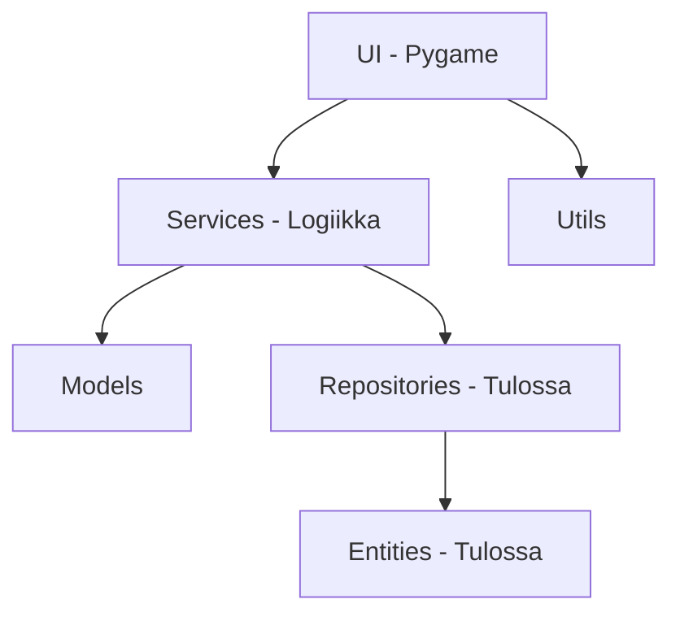
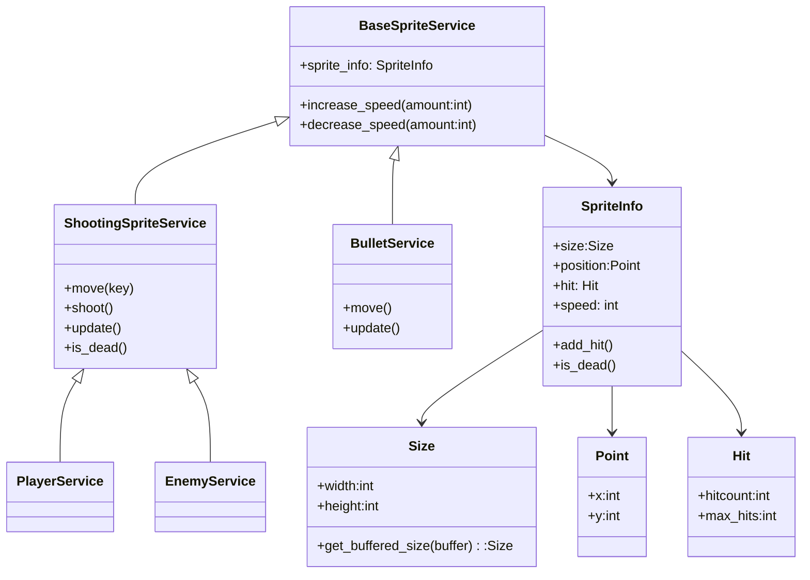
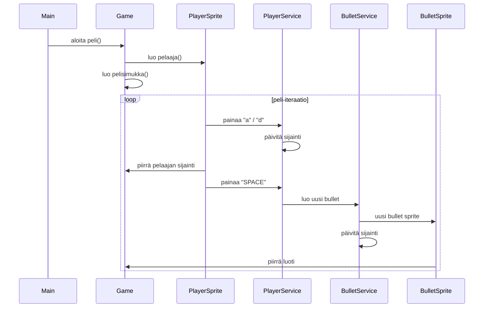
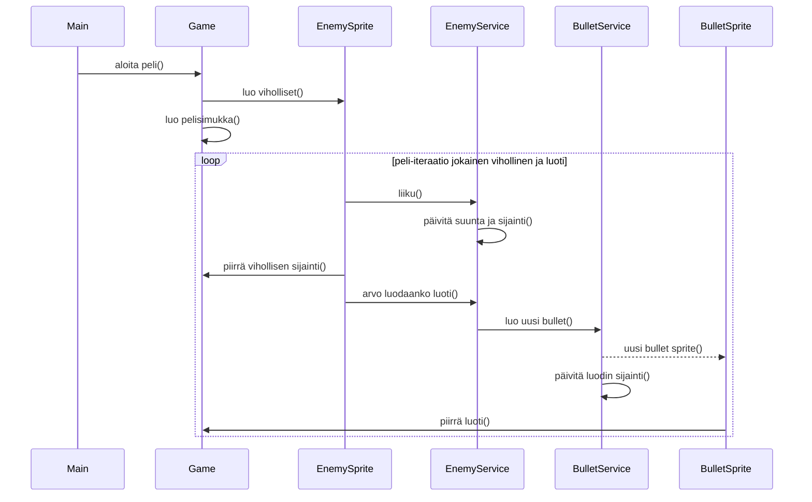
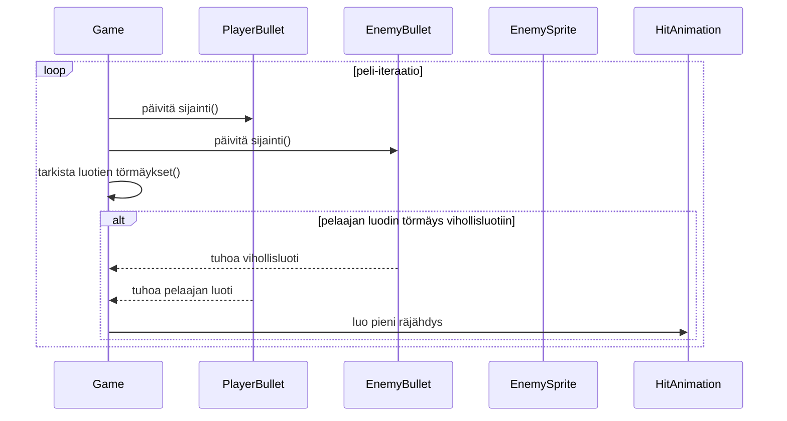
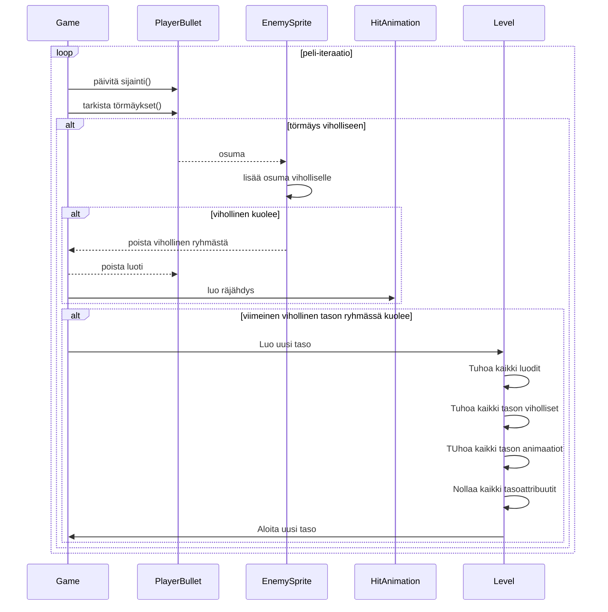
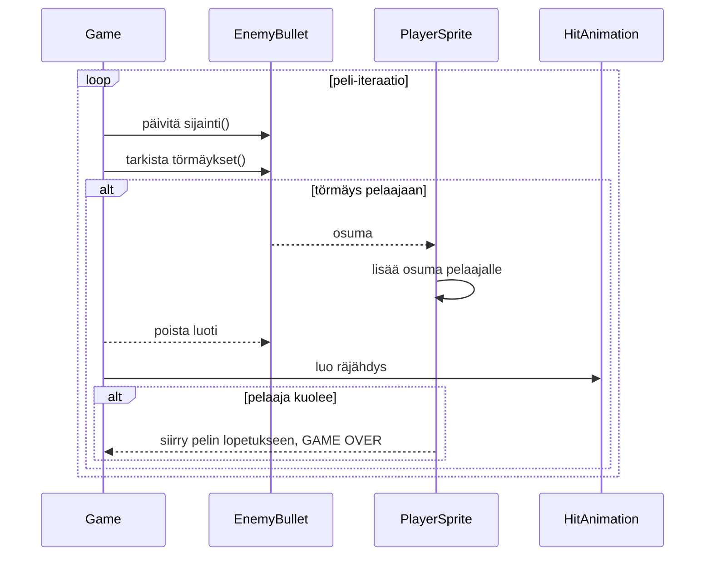

# Arkkitehtuurikuvaus

## Rakenne 

Pelin rakenne neudattaa seuraavanlaista kolmikerrosarkkitehtuuria: 

- ui-pakkaus sisältää käyttöliittymän eli pygame-osuuden 
- services-pakkaus sisältää pelilogiikan
- models-pakkaus sisältää luokkia, joita käytetään logiikkapakkauksessa esim. tietojen organisointiin
- utils-pakkaus sisältää nyt UI:sta erotettuja apufunktioita, jotka eivät suoraan kuuluu mihinkään serviceen, mutta logiikka on haluttu erottaa käyttöliittymästä, jotta sitä voi testata (tämä rakenne saattaa vielä muuttua ja olisi ehkä hyvä refaktoroida esim. game_serviceksi)
- TODO vaiheessa on repositories ja entities, jonne tulee myöhemmin tietojen pysyväistallennuksesta vastaava koodi ja tietokantatauluja vastaavat python-rakenteet eli entiteetit.  

## Käyttöliittymä 

Käyttöliittymä sisältää Pygame-pelin. Se sisältää tällä hetkellä pelkän pelinäkymän, joka alkaa suoraan, kun sovellus käynnistetään. 
TODO vaiheessa ovat käyttäjän luominen ja kirjautuminen eli aloitusnäkymä ja kirjautumisnäkymä. Näkymät sijaitsevat ui-kansiossa, jonne on eristetty kaikki Pygame-koodi. Kansion entrypoint on game.py. Peli käynnistetään src-kansion juuresta, tiedostosta main.py.  

## Sovelluslogiikka 

playerservice, bulletservice ja enemyservice, jakavat base-luokan base_sprite_service. Lisäksi player- ja enemyservice perivät shootingSpriteService:n. Base-luokassa on kaikille yhteisiä yleisiä ominaisuuksia, kuten koko, sijainti ja nopeus. 

Service-luokkien ja luokan ja ohjelman muiden osien suhdetta kuvaava luokkakaavio:

## Tietojen pysyväistallennus 

Tämä osio on vielä toteuttamatta, mutta tietokantaan tallennetaan jatkossa rekisteröityneet käyttäjät ja käyttäjät pelistatistiikat. 

## Ohjaustiedostot 

Sovelluksen globaalit vakiot on tallennettu config.py-tiedostoon. Lisäksi tasojen vakiottiedot on tallennettu level config-tiedostoon. Tasovakioilla ohjataan pelille oikea arvo esim. vihollisen kestävyys pelin edetessä. 

Sovellukselle on myös tulossa SQLite-tietokannan alustustiedosto. 

## Päätoiminnallisuudet

Kuvataan seuraavaksi sovelluksen toimintalogiikka muutaman päätoiminnallisuuden osalta sekvenssikaaviona.

## Käyttäjän kirjautuminen 

Toiminnallisuus toteuttamatta 

## Uuden käyttäjän luominen 

Toiminnallisuus toteuttamatta

## Pelin eteneminen 

Pelin ylätasokaavio:

---

### Pelaajan ja vihollisen perustoiminnot

Pelin käynnistyminen ja pelaajan toiminnot:

---
Pelin käynnistyminen ja vihollisen toiminnot:

---

### Yhteentörmäystarkistukset:

Pelaajan luoti ja vihollisen luoti

---

Pelaajan luoti ja viholliset:

---

Vihollisen  luoti ja pelaaja:

# Jatkokehitystä vaativat toiminnallisuudet ja rakenteelliset heikkoudet

Toiminnallisuus toteuttamatta