# Arkkitehtuurikuvaus

## Rakenne 

Pelin rakenne noudattaa seuraavanlaista kolmikerrosarkkitehtuuria: 

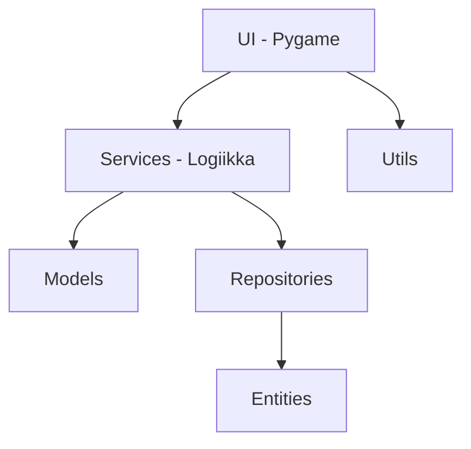
```mermaid
graph TD
    UI[UI - Pygame] --> Services
    UI[UI - Pygame] --> Utils
    Services[Services - Logiikka] --> Models
    Services --> Repositories[Repositories]
    Repositories --> Entities[Entities]

```

- ui-pakkaus sisältää käyttöliittymän eli pygame-osuuden 
- services-pakkaus sisältää pelilogiikan
- models-pakkaus sisältää luokkia, joita käytetään services-pakkauksessa esim. tietojen organisointiin. 
- utils-pakkaus sisältää yksinkertaisia ja itsenäisiä apufunktioita, jotka eivät suoraan kuulu mihinkään serviceen. Kaikki utils-funktiot testataan.
- repositories-pakkaus vastaa pysyväistallennuksesta sqlite-tietokantaan. 
- entities-pakkaus, jossa on tietokantatauluja vastaavat python-rakenteet eli entiteetit. Entiteetit ovat dataclass-tyyppisiä olioita, joiden tarkoitus on mallintaa tietokantakyselyjen tuloksia. 

## Käyttöliittymä 

Käyttöliittymä koostuu uuden käyttäjän luomisesta, kirjautumisesta ja itse pelistä. Näkymät sijaitsevat "ui/game_views"-kansiossa, jonne on eristetty kaikki Pygame-koodi. Kansion entrypoint on main.py. Peli käynnistetään src-kansion juuresta, tiedostosta main.py. Aloitusnäkymässä voi siirtyä suoraan pelinäkymään, jolloin pelaajan henkilökohtaisia tuloksia ei tallenneta. Käyttäjä voi myös luoda uuden käyttäjätunnuksen ja kirjautua sisään, jolloin tulokset tallennetaan tietokantaan.   

Käyttöliittymän flowchart-kaavio:
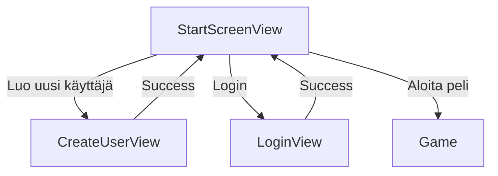
```mermaid
flowchart TD
    StartScreenView -->|Luo uusi käyttäjä| CreateUserView
    CreateUserView -->|Success| StartScreenView
    StartScreenView -->|Login| LoginView
    LoginView -->|Success| StartScreenView
    StartScreenView -->|Aloita peli| Game
```
---

Käyttöliittymävalikon luokat: 

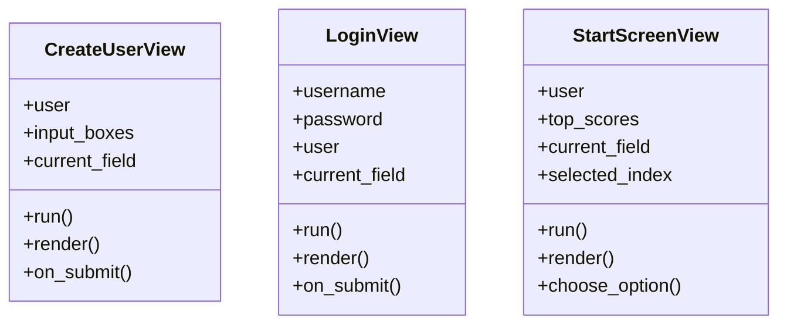
```mermaid
classDiagram

    class CreateUserView {
        +user
        +input_boxes
        +current_field
        +run()
        +render()
        +on_submit()
    }

    class LoginView {
        +username
        +password
        +user
        +current_field
        +run()
        +render()
        +on_submit()
    }

    class StartScreenView {
        +user
        +top_scores
        +current_field
        +selected_index
        +run()
        +render()
        +choose_option()
    }
```

### Käyttöliittymävalikon näkymät:

Näkymissä käytetään luokkien yhteistoimintaa (composition) ja niihin esimerkiksi injektoidaan sessio, jonka kautta ne kaikki näkevät peliin kirjautuneen käyttäjän ja käyttäjien tilastoja. 

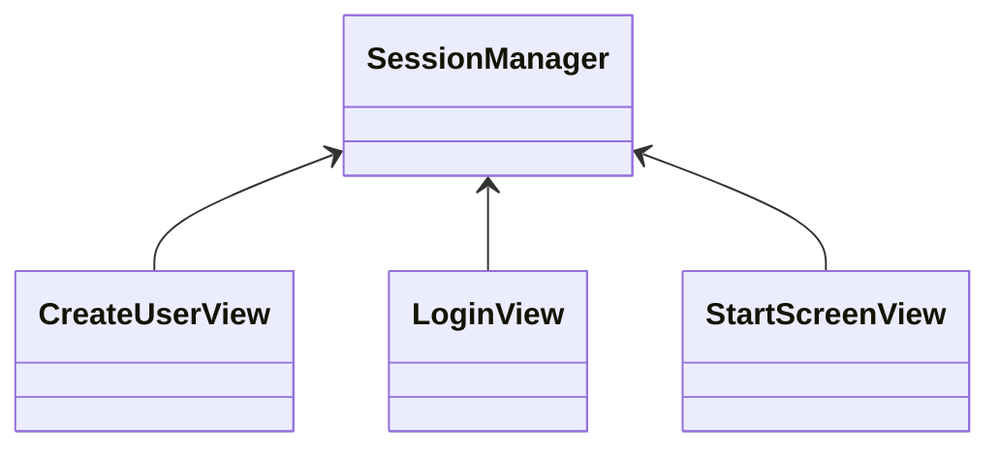
```mermaid 
 classDiagram

    class SessionManager

    SessionManager <-- CreateUserView
    SessionManager <-- LoginView
    SessionManager <-- StartScreenView
```
---

Näkymät jakavat yhteisen piirtäjän, joka huolehtii kaikille yhteisistä ruudunpäivityksistä. 
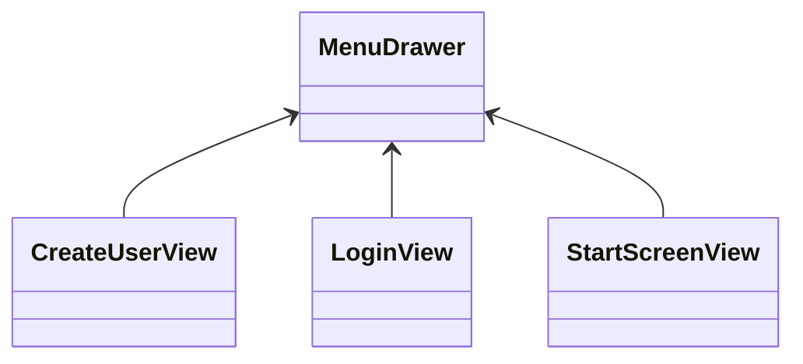
```mermaid 
 classDiagram

    class MenuDrawer

    MenuDrawer <-- CreateUserView
    MenuDrawer <-- LoginView
    MenuDrawer <-- StartScreenView
```

---
Login- ja CreateUserView-näkymillä on lisäksi yhteinen EventLoop, joka huolehtii luokkien pääsilmukan tapahtumien kuuntelusta.
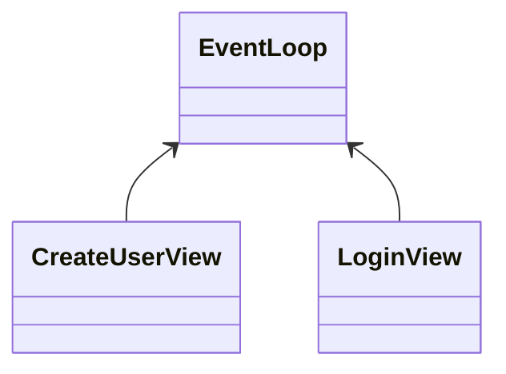
```mermaid 
 classDiagram

    class EventLoop


    EventLoop <-- CreateUserView
    EventLoop <-- LoginView
```
---

## Peli:

Peli sijaitsee omassa kansiossaan ja se käynnistetään StartScreenView-luokasta. 
Pelillä on oma piirtäjänsä, koska sen logiikka eroaa oleellisesti muista UI-näkymistä. Lisäksi sillä on oma initialisointiluokka, jotta peliluokasta ei tulisi liian suuri. Initialisointitiedostoon on eristetty itsenäisiä funktioita, mutta se ei ole aputiedosto eikä toisaalta luokka, joka injektoidaan peliin.
Peli toimii yhdessä GameDrawer-luokan kanssa, joka huolehtii ruudunpäivityksestä ja animaatioista peliluupin jokaisen kierroksen aikana.

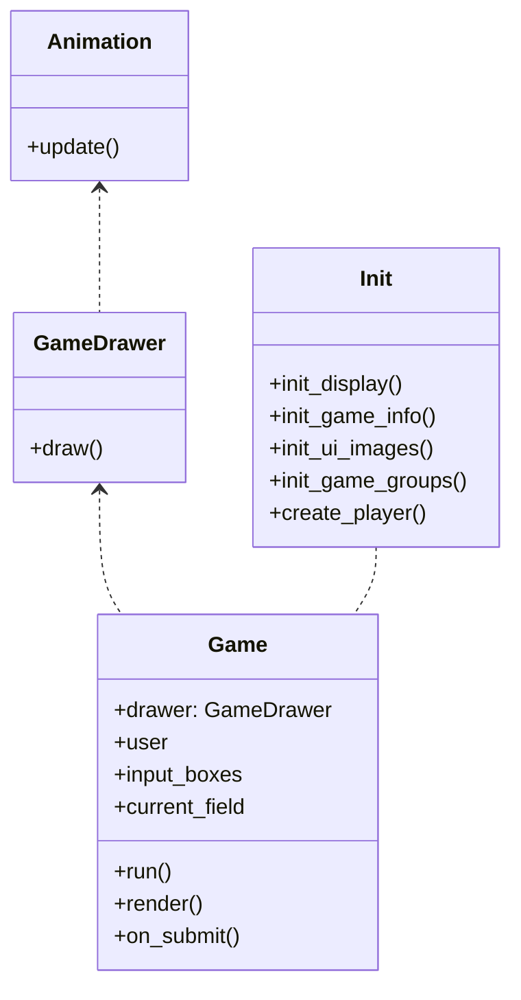
```mermaid
classDiagram

class Animation {
    +update()
}

class GameDrawer {
    +draw()
}

class Init {
    +init_display()
    +init_game_info()
    +init_ui_images()
    +init_game_groups()
    +create_player()
}

class Game {
        +drawer: GameDrawer
        +user
        +input_boxes
        +current_field
        +run()
        +render()
        +on_submit()
    }
Animation <.. GameDrawer
GameDrawer <.. Game
Init .. Game

```

## Sovelluslogiikka 

PlayerService, EnemyService ja BulletService toimivat yhdessä BaseSpriteService-luokan kanssa. Lisäksi PlayerService- ja EnemyService-luokkiin injektoidaan ShootingService. ShootingService huolehtii ampumisesta. Base-luokassa on kaikille yhteisiä metodeja, kuten nopeuden muuttaminen ja osuman lisääminen. ShootingSpriteService-luokassa on player- ja enemyservicelle yhteisiä ominaisuuksia, kuten koko, sijainti ja nopeus. 

Service-luokkien ja luokan ja ohjelman muiden osien suhdetta kuvaava luokkakaavio:

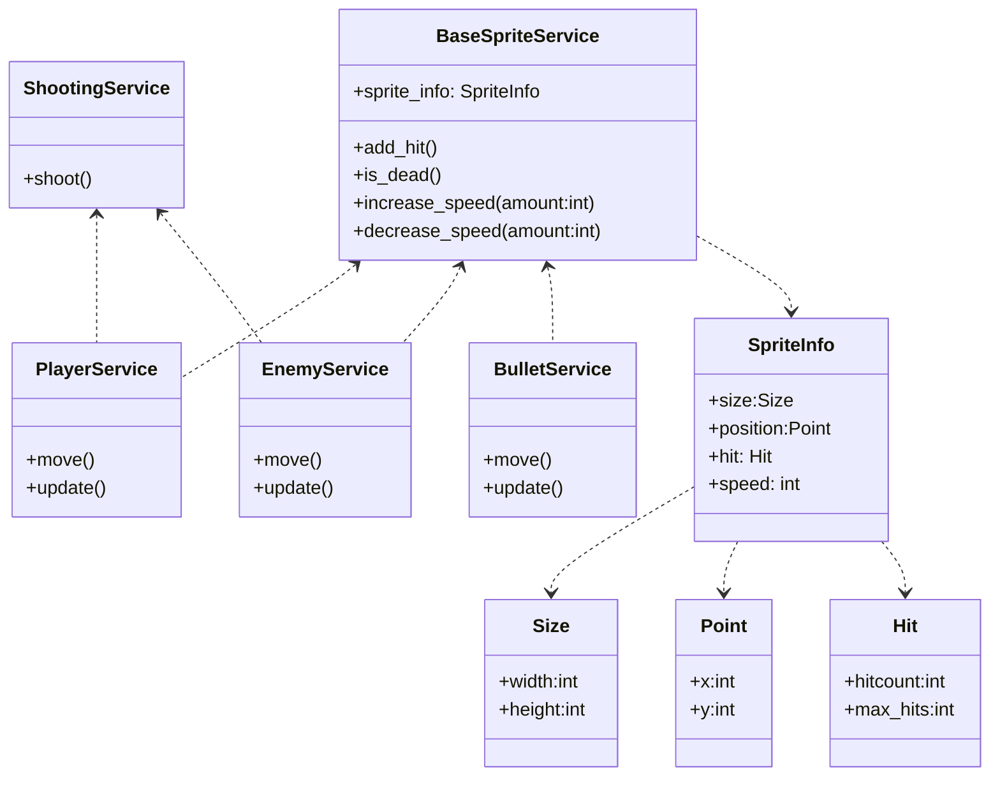
```mermaid
classDiagram
    class BaseSpriteService {
        +sprite_info: SpriteInfo
        +add_hit()
        +is_dead()  
        +increase_speed(amount:int)
        +decrease_speed(amount:int)
    }

    class ShootingService {
        +shoot()
    }

    class PlayerService {
       +move()
       +update()
    }

    class EnemyService {
        +move()
        +update()
    }

    class BulletService {
        +move()
        +update()
    }

    class SpriteInfo{
        +size:Size
        +position:Point
        +hit: Hit
        +speed: int   
    }

    class Size{
        +width:int
        +height:int
    }

    class  Point{
        +x:int
        +y:int
    }

    class  Hit{
        +hitcount:int
        +max_hits:int
    }
 

    BaseSpriteService <.. PlayerService
    BaseSpriteService <.. EnemyService
    BaseSpriteService <.. BulletService

    ShootingService <.. PlayerService
    ShootingService <.. EnemyService

    SpriteInfo ..> Size
    SpriteInfo ..> Point
    SpriteInfo ..> Hit
    BaseSpriteService ..> SpriteInfo
```

### Tasojen generointi ja uudelle tasolle siirtyminen

Tasot generoidaan levelservice-luokassa level_config-tiedoston vakioarvojen ohjaamana, kun peli alkaa. 

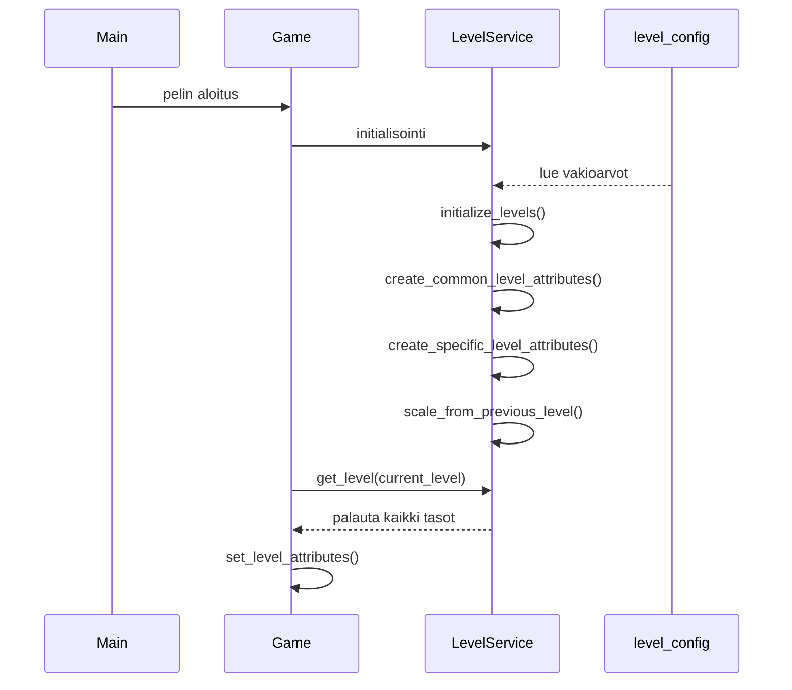
```mermaid
sequenceDiagram
    participant Main
    participant Game
    participant LevelService
    participant level_config

    Main->>Game: pelin aloitus
    Game->>LevelService: initialisointi
    level_config-->>LevelService: lue vakioarvot
    LevelService->>LevelService: initialize_levels()

    LevelService->>LevelService: create_common_level_attributes()
    LevelService->>LevelService: create_specific_level_attributes()
    LevelService->>LevelService: scale_from_previous_level()


    Game->>LevelService: get_level(current_level)
    LevelService-->>Game: palauta kaikki tasot
    Game->>Game: set_level_attributes()

    
 
```
---
Uudelle tasolle siirtyminen

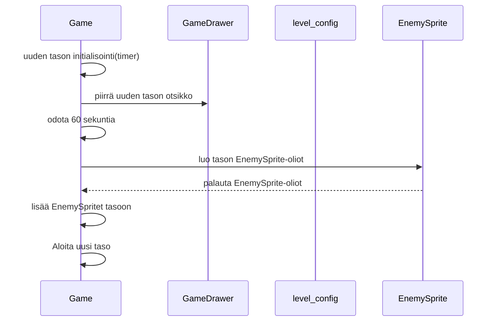
```mermaid
sequenceDiagram
    participant Game
    participant GameDrawer
    participant level_config
    participant EnemySprite

    Game->>Game: uuden tason initialisointi(timer)
    Game->>GameDrawer: piirrä uuden tason otsikko
    Game->>Game: odota 60 sekuntia
    Game->>EnemySprite: luo tason EnemySprite-oliot
    EnemySprite-->>Game: palauta EnemySprite-oliot
    Game->>Game: lisää EnemySpritet tasoon
    Game->>Game: Aloita uusi taso
   
 
```

## Tietojen pysyväistallennus 

Tietokantaan tallennetaan rekisteröityneet käyttäjät ja käyttäjät pelistatistiikat. 

Tietojen pysyväistallennuksen yleiskaavio: 

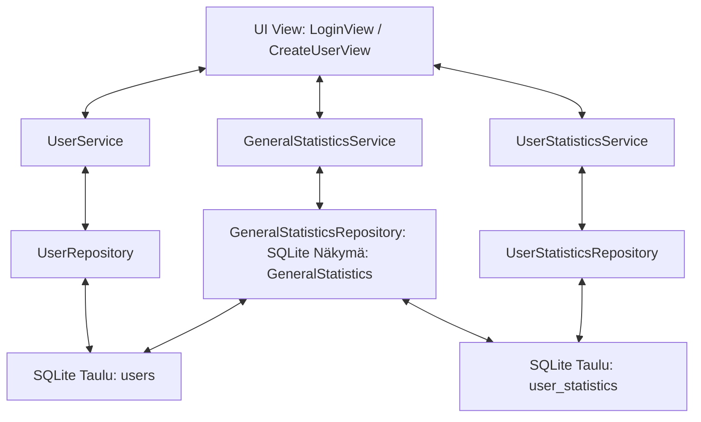
```mermaid
flowchart TD
    UI[UI View: LoginView / CreateUserView]

    UI <--> US[UserService]
    UI <--> USS[UserStatisticsService]
    UI <--> GSS[GeneralStatisticsService]

    US <--> UR[UserRepository]
    USS <--> USR[UserStatisticsRepository]
    GSS <--> GSR[GeneralStatisticsRepository: SQLite Näkymä: GeneralStatistics] 

    GSR <--> DB_USERS[SQLite Taulu: users]
    
    UR <--> DB_USERS[SQLite Taulu: users]
    USR <--> DB_STATS[SQLite Taulu: user_statistics]
    GSR <--> DB_STATS[SQLite Taulu: user_statistics]
```

## Ohjaustiedostot 

Sovelluksen globaalit vakiot on tallennettu config.py-tiedostoon. Lisäksi tasojen vakiotiedot on tallennettu level config-tiedostoon. Tasovakioilla ohjataan pelille oikea arvo, esim. vihollisen kestävyys, pelin edetessä. 

SQLite-tietokanta alustetaan sql-tiedostoilla. `schema.sql` luo taulut ja näkymän.  
`seed_data.sql` luo kantaan __guest__-käyttäjän pelaajalle, joka ei halua luoda itselleen tunnusta.

## Päätoiminnallisuudet

Sovelluksen toimintalogiikan päätoiminnallisuudet sekvenssikaaviona.

## Käyttäjän kirjautuminen  

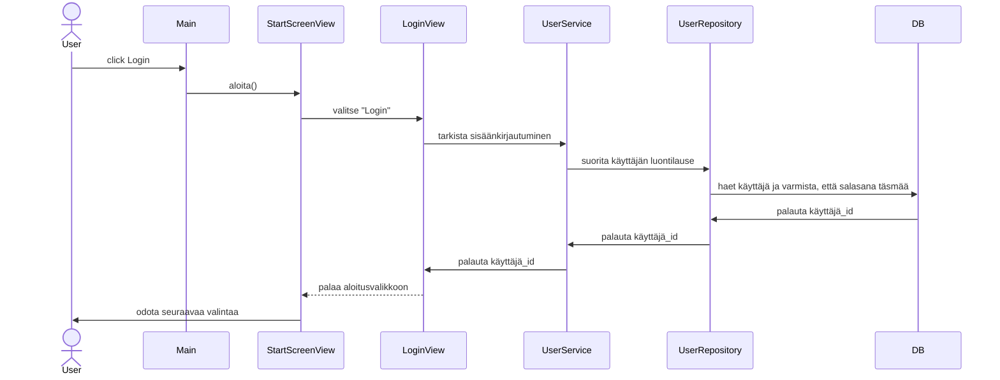
```mermaid 
sequenceDiagram
    actor User
    participant Main
    participant StartScreenView
    participant LoginView
    participant UserService
    participant UserRepository
    participant DB

    User->>Main: click Login
    Main->>StartScreenView: aloita()
    StartScreenView->>LoginView: valitse "Login"
    LoginView->>UserService: tarkista sisäänkirjautuminen
    UserService->>UserRepository: suorita käyttäjän luontilause
    UserRepository->>DB: haet käyttäjä ja varmista, että salasana täsmää
    DB->>UserRepository: palauta käyttäjä_id
    UserRepository->>UserService: palauta käyttäjä_id
    UserService->>LoginView: palauta käyttäjä_id
    LoginView-->>StartScreenView: palaa aloitusvalikkoon
    StartScreenView->>User: odota seuraavaa valintaa


```

## Uuden käyttäjän luominen 

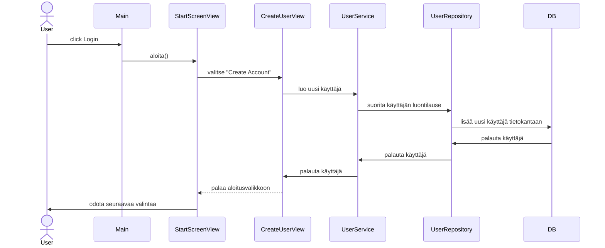
```mermaid 
sequenceDiagram
    actor User
    participant Main
    participant StartScreenView
    participant CreateUserView
    participant UserService
    participant UserRepository
    participant DB

    User->>Main: click Login
    Main->>StartScreenView: aloita()
    StartScreenView->>CreateUserView: valitse "Create Account"
    CreateUserView->>UserService: luo uusi käyttäjä
    UserService->>UserRepository: suorita käyttäjän luontilause
    UserRepository->>DB: lisää uusi käyttäjä tietokantaan
    DB->>UserRepository: palauta käyttäjä
    UserRepository->>UserService: palauta käyttäjä 
    UserService->>CreateUserView: palauta käyttäjä
    CreateUserView-->>StartScreenView: palaa aloitusvalikkoon
    StartScreenView->>User: odota seuraavaa valintaa


```

## Pelin eteneminen 

Pelin ylätasokaavio:

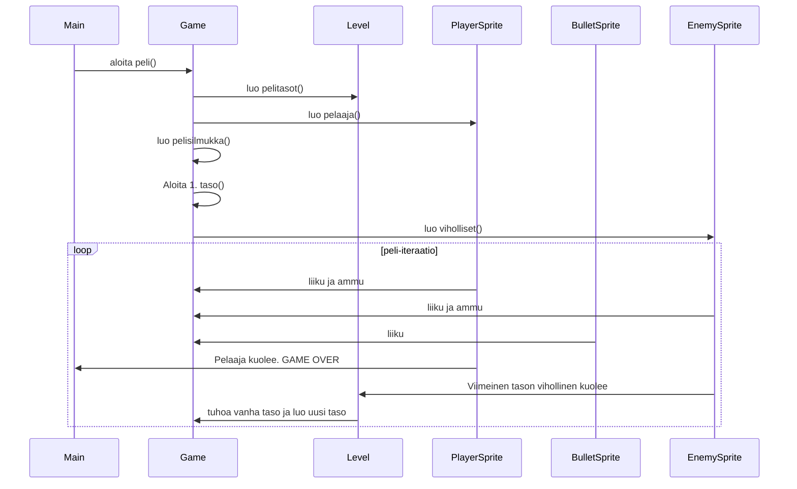
```mermaid
sequenceDiagram
    participant Main
    participant Game
    participant Level
    participant PlayerSprite
    participant BulletSprite
    participant EnemySprite

    Main->>Game: aloita peli()
    Game->>Level: luo pelitasot()
    Game->>PlayerSprite:luo pelaaja()
    Game->>Game: luo pelisilmukka()
    Game->>Game: Aloita 1. taso()
    Game->>EnemySprite: luo viholliset()
    
    loop peli-iteraatio
        PlayerSprite->>Game: liiku ja ammu
        EnemySprite->>Game: liiku ja ammu
        BulletSprite->>Game: liiku
        PlayerSprite->>Main: Pelaaja kuolee. GAME OVER
        EnemySprite->>Level: Viimeinen tason vihollinen kuolee
        Level->>Game: tuhoa vanha taso ja luo uusi taso
    end
```
---

Uuden tason luominen. Taso 1 luodaan aina kun peli alkaa alusta. Uusi taso luodaan level_servicen tietojen mukaan aina kun edellisen tason kaikki viholliset on tuhottu. 

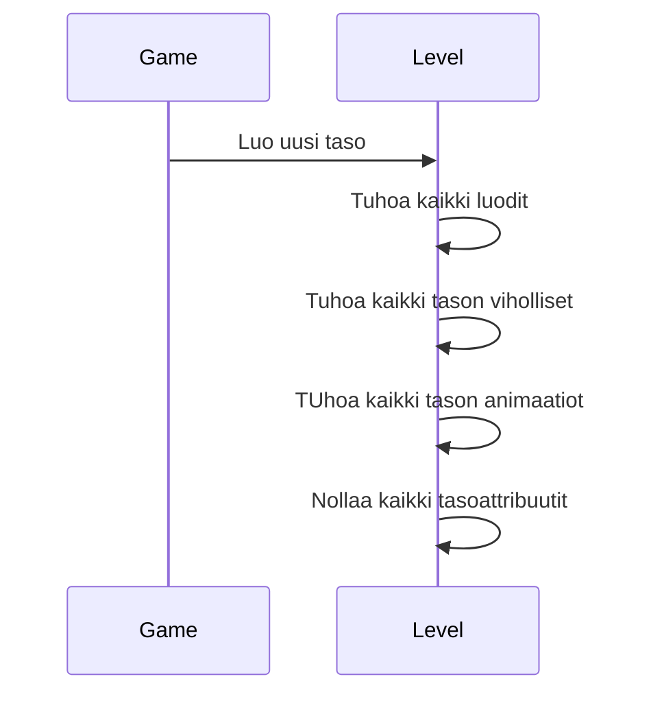
```mermaid
sequenceDiagram
    participant Game
    participant Level
    
    Game->>Level: Luo uusi taso
    Level->>Level: Tuhoa kaikki luodit
    Level->>Level: Tuhoa kaikki tason viholliset
    Level->>Level: TUhoa kaikki tason animaatiot
    Level->>Level: Nollaa kaikki tasoattribuutit
```

### Pelaajan ja vihollisen perustoiminnot

Pelin käynnistyminen ja pelaajan toiminnot:

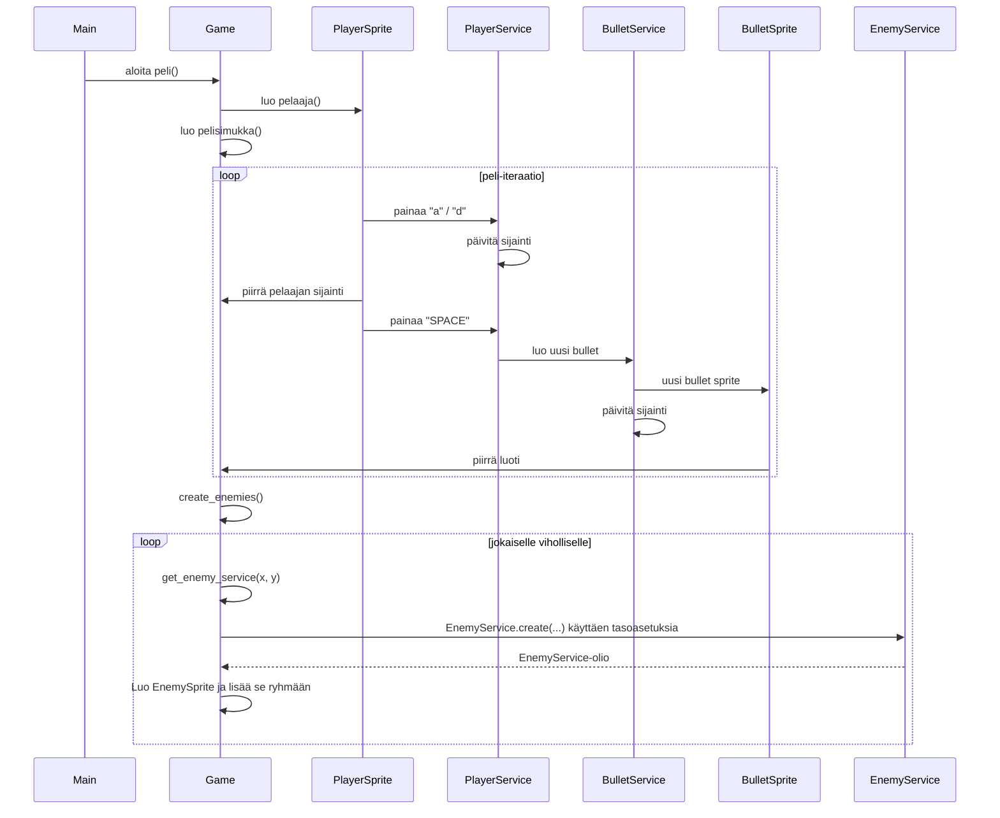
```mermaid
sequenceDiagram
    participant Main
    participant Game
    participant PlayerSprite
    participant PlayerService
    participant BulletService
    participant BulletSprite

    Main->>Game: aloita peli()
    Game->>PlayerSprite:luo pelaaja()
    Game->>Game: luo pelisimukka()

    loop peli-iteraatio
        PlayerSprite->>PlayerService: painaa "a" / "d"
        PlayerService->>PlayerService: päivitä sijainti
        PlayerSprite->>Game: piirrä pelaajan sijainti
        PlayerSprite->>PlayerService: painaa "SPACE"
        PlayerService->>BulletService: luo uusi bullet
        BulletService->>BulletSprite: uusi bullet sprite
        BulletService->>BulletService: päivitä sijainti
        BulletSprite->>Game: piirrä luoti
    end

    Game->>Game: create_enemies()
    loop jokaiselle viholliselle
        Game->>Game: get_enemy_service(x, y)
        Game->>EnemyService: EnemyService.create(...) käyttäen tasoasetuksia
        EnemyService-->>Game: EnemyService-olio
        Game->>Game: Luo EnemySprite ja lisää se ryhmään
    end
```
---
Pelin käynnistyminen ja vihollisen toiminnot:

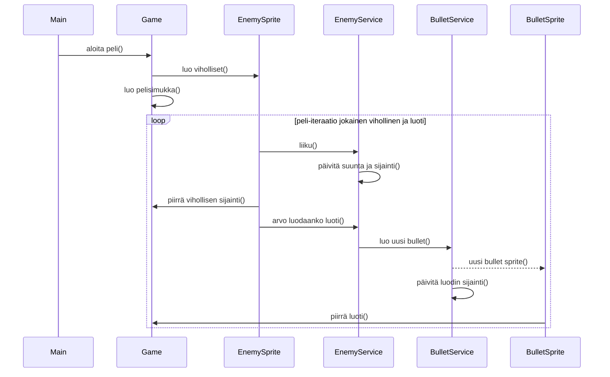
```mermaid
sequenceDiagram
    participant Main
    participant Game
    participant EnemySprite
    participant EnemyService
    participant BulletService
    participant BulletSprite

    Main->>Game: aloita peli()
    Game->>EnemySprite:luo viholliset()
    Game->>Game: luo pelisimukka()

    loop peli-iteraatio jokainen vihollinen ja luoti
        EnemySprite->>EnemyService: liiku() 
        EnemyService->>EnemyService: päivitä suunta ja sijainti()
        EnemySprite->>Game: piirrä vihollisen sijainti()
        EnemySprite->>EnemyService: arvo luodaanko luoti()
        EnemyService->>BulletService: luo uusi bullet()
        BulletService-->>BulletSprite: uusi bullet sprite()
        BulletService->>BulletService: päivitä luodin sijainti()
        BulletSprite->>Game: piirrä luoti()
    end
```
---

### Yhteentörmäystarkistukset:

Pelaajan luoti ja vihollisen luoti

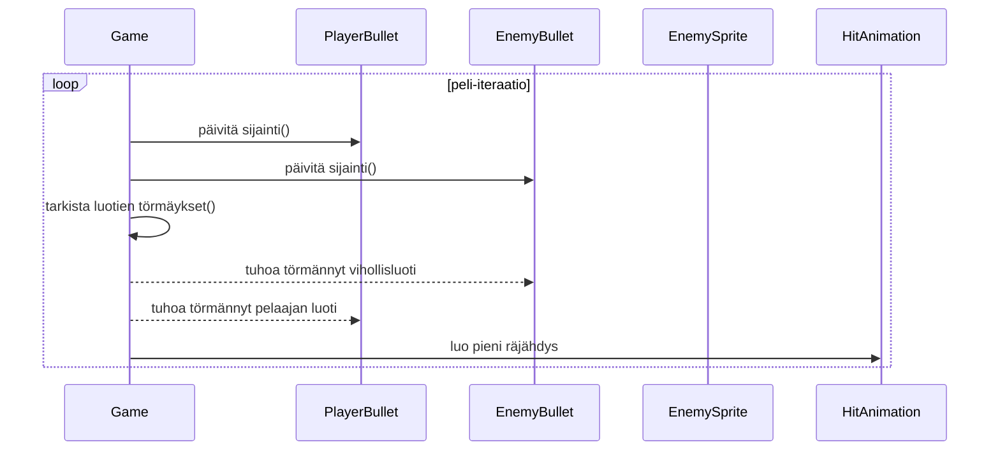
```mermaid

sequenceDiagram
    participant Game
    participant PlayerBullet
    participant EnemyBullet
    participant EnemySprite
    participant HitAnimation

    loop peli-iteraatio
        Game->>PlayerBullet: päivitä sijainti()
        Game->>EnemyBullet: päivitä sijainti()
        Game->>Game: tarkista luotien törmäykset()

        Game-->>EnemyBullet: tuhoa törmännyt vihollisluoti
        Game-->>PlayerBullet: tuhoa törmännyt pelaajan luoti
        Game->>HitAnimation: luo pieni räjähdys
        
    end
```
---

Pelaajan luoti ja viholliset:

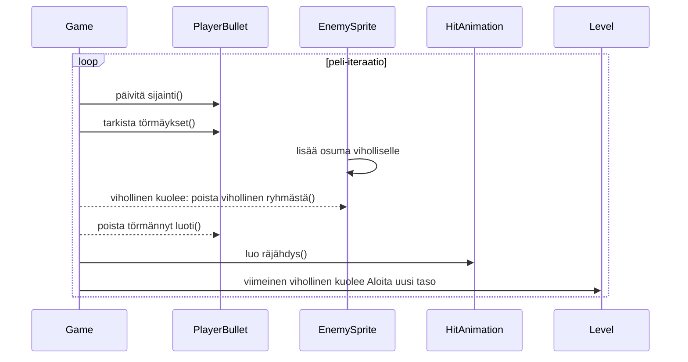
```mermaid
sequenceDiagram
    participant Game
    participant PlayerBullet
    participant EnemySprite
    participant HitAnimation
    participant Level

    loop peli-iteraatio
        Game->>PlayerBullet: päivitä sijainti()
        Game->>PlayerBullet: tarkista törmäykset()

        EnemySprite->>EnemySprite: lisää osuma viholliselle
        
        Game-->>EnemySprite: vihollinen kuolee: poista vihollinen ryhmästä()
        Game-->>PlayerBullet: poista törmännyt luoti()
        Game->>HitAnimation: luo räjähdys()
        
        Game->>Level: viimeinen vihollinen kuolee Aloita uusi taso
        
    end

```
---

Vihollisen  luoti ja pelaaja:

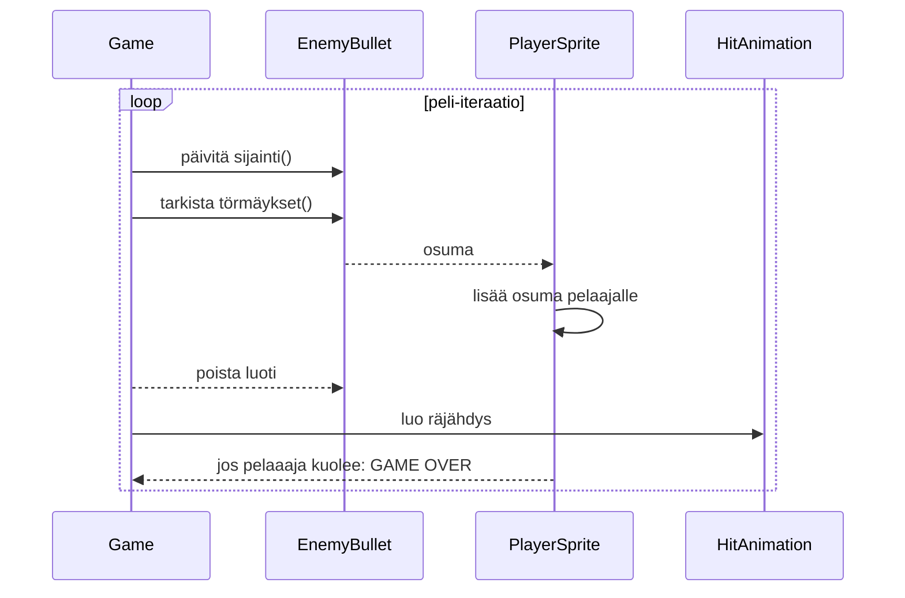
```mermaid
sequenceDiagram
    participant Game
    participant EnemyBullet
    participant PlayerSprite
    participant EnemyBullet
    participant HitAnimation

    loop peli-iteraatio
        Game->>EnemyBullet: päivitä sijainti()
        Game->>EnemyBullet: tarkista törmäykset()

       
        EnemyBullet-->>PlayerSprite: osuma
        PlayerSprite->>PlayerSprite: lisää osuma pelaajalle
        Game-->>EnemyBullet: poista luoti
        Game->>HitAnimation: luo räjähdys
        
        PlayerSprite-->>Game: jos pelaaaja kuolee: GAME OVER 
    end

```

# Rakenteelliset heikkoudet ja ideat jatkokehitykseen

- Testeille generoidaan dataa, joka eri testien välillä konfliktoi keskenään, mikäli edellisen testin dataa muokataan tai se poistetaan. Jokainen testi alkaakin ns. puhtaalta pöydältä ja tietokannan alustus tehdään uudestaan jokaiselle integraatiotestille. Jos projekti laajenee ja testien määrä kasvaa, niiden suorittaminen hidastuu. Testit voidaan projektin laajentuessa ajaa esim. CI/CD-putkessa ja tällöin niiden nopea suoritusaika on tärkeää. Tähän pitäisi miettiä ratkaisu, jolla testien ajaminen nopeutuu. 

- Virheilmoitukset ja virheiden käsittely voisivat sijaita omassa luokassaan, mikä standardoisi ja helpottaisi niiden hallintaa, mikäli ohjelma laajenisi.

- Sprite-olioiden liikkuminen on nyt yksinkertaista. SpriteService-luokilla on nyt liikkuminen osana olioluokkaa. Monimutkaisempien liikeratojen laskenta ja nykyinen liikelaskenta kannattaisi eristää omaan palveluunsa, esim. MovementService ja injektoida Enemy- , Player- ja BulletService:lle. Tällöin ohjelman laajennettavuus olisi helpompaa.