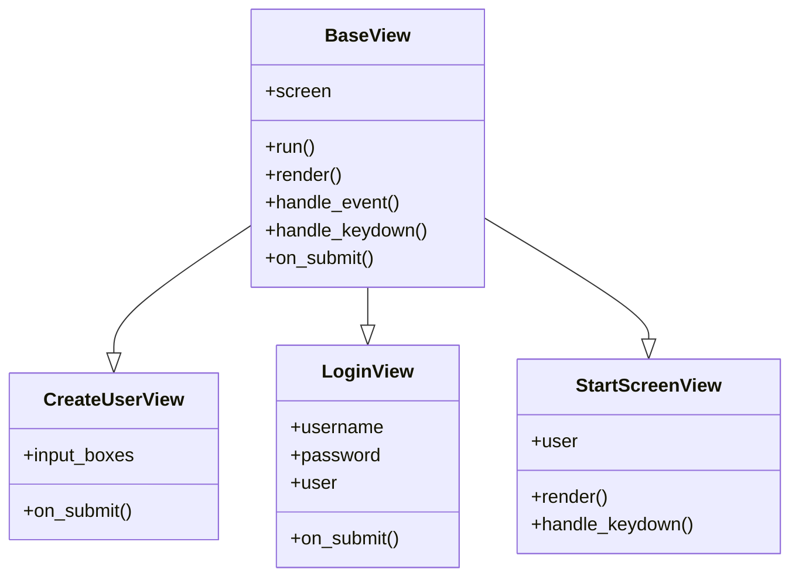
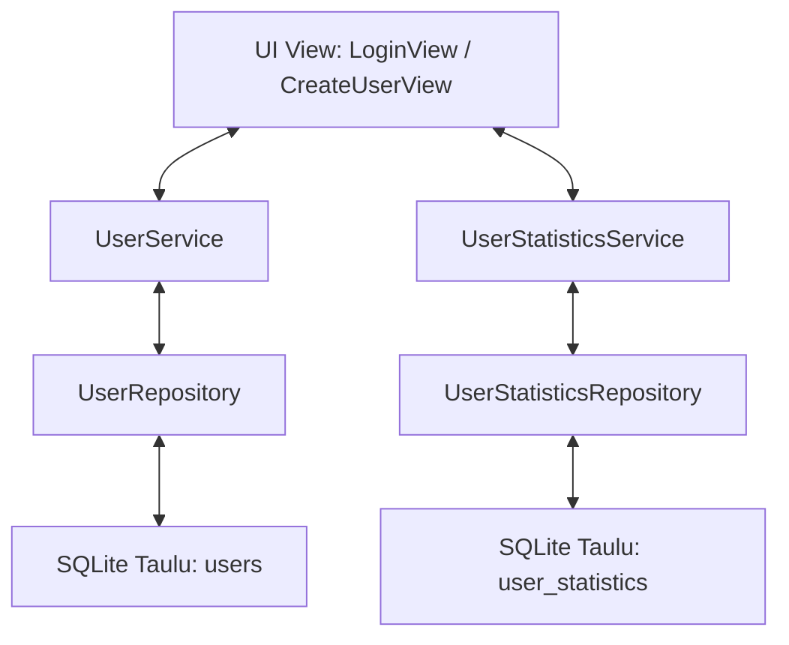
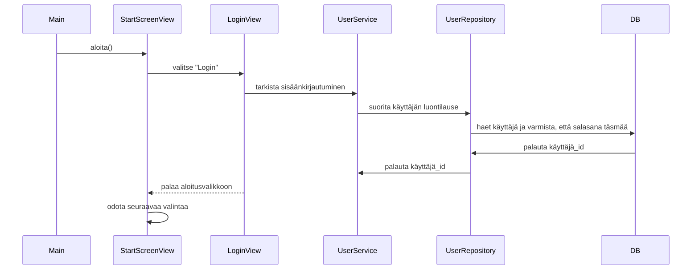
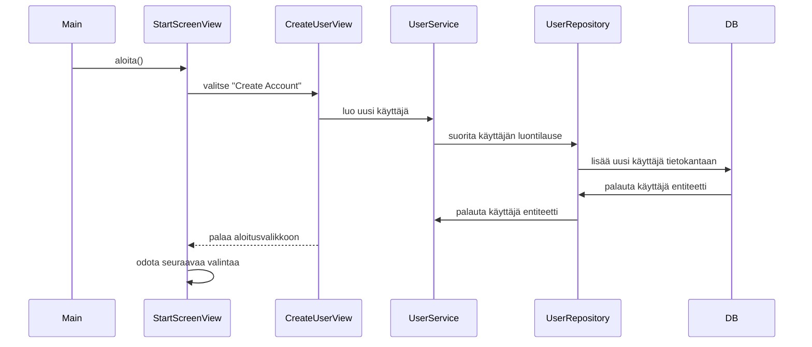

# Arkkitehtuurikuvaus

## Rakenne 

Pelin rakenne neudattaa seuraavanlaista kolmikerrosarkkitehtuuria: 

- ui-pakkaus sisältää käyttöliittymän eli pygame-osuuden 
- services-pakkaus sisältää pelilogiikan
- models-pakkaus sisältää luokkia, joita käytetään logiikkapakkauksessa esim. tietojen organisointiin
- utils-pakkaus sisältää nyt UI:sta erotettuja apufunktioita, jotka eivät suoraan kuuluu mihinkään serviceen, mutta logiikka on haluttu erottaa käyttöliittymästä, jotta sitä voi testata.
- repositories-pakkaus vastaa pysyväistallennuksesta sqlite-tietokantaan. 
- entities-pakkaus, jossa on tietokantatauluja vastaavat python-rakenteet eli entiteetit.  

## Käyttöliittymä 

Käyttöliittymä koostuu uuden käyttäjän luomisesta, kirjautumisesta ja itse pelistä. Näkymät sijaitsevat "ui/game_views"-kansiossa, jonne on eristetty kaikki Pygame-koodi. Kansion entrypoint on main.py. Peli käynnistetään src-kansion juuresta, tiedostosta main.py. Aloitusnäkymässä voi siirtyä suoraan pelinäkymään, jolloin pelaajan henkilökohtaisia tuloksia ei tallenneta. Käyttäjä voi myös luoda uuden käyttäjätunnuksen ja kirjautua sisään, jolloin tulokset tallennetaan tietokantaan.   

Käyttöliittymän flowchart-kaavio:

---

Käyttäjähallintanäkymät:

## Sovelluslogiikka 

Playerservice, bulletservice ja enemyservice, jakavat base-luokan base_sprite_service. Lisäksi player- ja enemyservice perivät shootingSpriteService:n. Base-luokassa on kaikille yhteisiä yleisiä ominaisuuksia, kuten koko, sijainti ja nopeus. 

Service-luokkien ja luokan ja ohjelman muiden osien suhdetta kuvaava luokkakaavio:

### Tasojen generointi

Tasot generoidaan levelservice-luokassa level_config-tiedoston vakioarvojen ohjaamana. 

## Tietojen pysyväistallennus 

Tietokantaan tallennetaan rekisteröityneet käyttäjät ja käyttäjät pelistatistiikat. 

Tietojen pysyväistallennuksen yleiskaavio: 

## Ohjaustiedostot 

Sovelluksen globaalit vakiot on tallennettu config.py-tiedostoon. Lisäksi tasojen vakiottiedot on tallennettu level config-tiedostoon. Tasovakioilla ohjataan pelille oikea arvo, esim. vihollisen kestävyys, pelin edetessä. 

Sovellukselle on myös tulossa SQLite-tietokannan alustustiedosto. 

## Päätoiminnallisuudet

Kuvataan seuraavaksi sovelluksen toimintalogiikka muutaman päätoiminnallisuuden osalta sekvenssikaaviona.

## Käyttäjän kirjautuminen  

## Uuden käyttäjän luominen 

## Pelin eteneminen 

Pelin ylätasokaavio:

---

### Pelaajan ja vihollisen perustoiminnot

Pelin käynnistyminen ja pelaajan toiminnot:

---
Pelin käynnistyminen ja vihollisen toiminnot:

---

### Yhteentörmäystarkistukset:

Pelaajan luoti ja vihollisen luoti

---

Pelaajan luoti ja viholliset:

---

Vihollisen  luoti ja pelaaja:

# Jatkokehitystä vaativat toiminnallisuudet ja rakenteelliset heikkoudet

Toiminnallisuus toteuttamatta