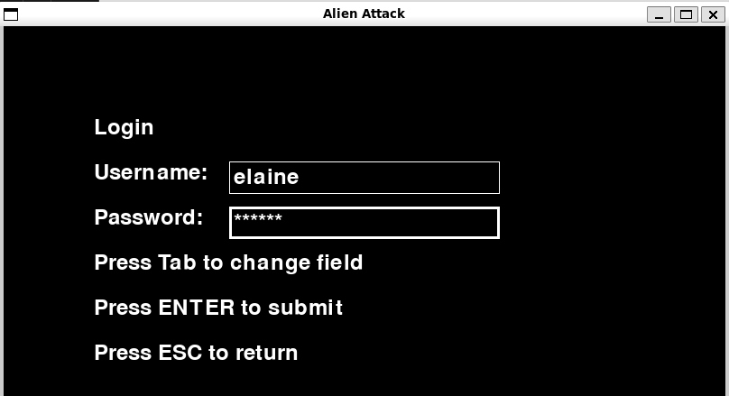
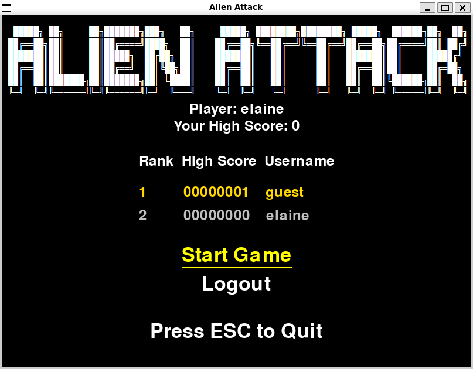

# Käyttöohje

Lataa projektin viimeisimmän [](https://github.com/Tapir79/ot-harjoitustyo/releases/latest) lähdekoodi valitsemalla _Assets_-osion alta _Source code_.

## Konfigurointi

Pelin tasojen vaikeutta voi säätää itse muuttamalla __level_config.py__ tiedostossa olevia attribuutteja. 
Tiedoston muoto on seuraava:

```
ENEMY_COOLDOWN = 30
ENEMY_SHOOTING_PROBABILITY = 0.0006
ENEMY_COLS = 4
ENEMY_ROWS = 2
...
```


## Ohjelman asentaminen ja käynnistäminen

Ensimmäisenä asenna poetryn riippuvuudet:

```bash
poetry install
```

Sen jälkeen lisätään projektiin tietokanta ja taulut komennolla:

```bash
poetry run invoke build
```

Ohjelma käynnistyy komennolla:

```
poetry run invoke start
```

## Aloitusvalikko

Peli käynnistyy aloitusvalikkoon:


Voit navigoida joko nuolinäppäimillä tai __TAB__-näppäimellä.

## Uuden käyttäjän luominen

Valitse __Create a New User__, 


jolloin peli ohjaa tähän näkymään:


Luo uusi käyttäjätunnus. 
Käyttäjätunnuksen on oltava vähintään 3 merkkiä pitkä ja enintään 8 merkkiä pitkä. 
Salasanan on oltava vähintään 3 merkkiä pitkä.
Käyttäjätunnus ja salasana saavat sisältää ainoastaan numeroita (0-9) ja kirjaimia (a-Ö).

Luotuasi uuden tunnuksen saat siitä ilmoituksen ja peli ohjautuu takaisin aloitusvalikkoon. 

## Kirjautuminen

Luotuasi käyttäjän voit kirjautua sisään. 
Valitse __Login__, 


jolloin peli ohjaa näkymään:



Syötä kenttiin tunnus ja salasana ja paina Enter, jolloin peli ohjautuu kirjautuneen käyttäjän aloitusvalikkoon:


## Pelin aloittaminen

Voit aloittaa pelin painamalla __Enter__, kun __Start Game__ on valittuna. Jos olet kirjautunut sisään, peli tallentaa henkilökohtaisen piste-ennätyksen ja korkeimman saavutetun tason. 

## Pelaaminen

Pelaaja on punainen alus ruudun alalaidassa.

Yritä väistellä sinisten vihollisten luoteja ja ampua vihollisia ennen kuin ne saavuttavat sinut. Saat jokaisesta ammutusta vihollisesta pisteitä. Tasot vaikeutuvat koko ajan. Viimeinen taso on 15. 

Jos vihollinen osuu pelaajaan 3 kertaa peli on ohi. 

Liikkuminen:     
- oikealle: paina __d__
- vasemmalle paina __a__

Ampuminen:      
- paina __spacebar__


 

### Vihollinen 1 

  
- Elämät: 1 
- Pisteet: 1

### Vihollinen 2

  
- Elämät: 2 
- Pisteet: 2

### Vihollinen 3

  
- Elämät: 3 
- Pisteet: 3

### Luoti

  
- Elämät: 1 
- Pisteet: taso * 1.5


