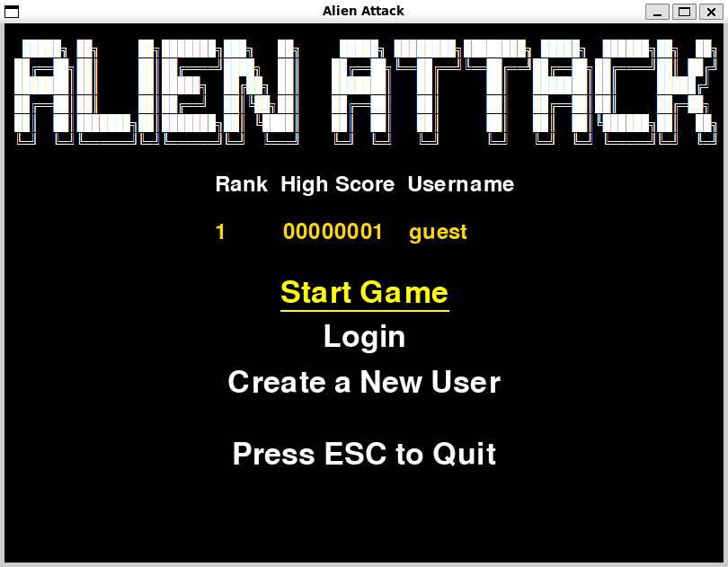

# Käyttöohje

Lataa projektin viimeisimmän [](https://github.com/Tapir79/ot-harjoitustyo/releases/latest) lähdekoodi valitsemalla _Assets_-osion alta _Source code_.

## Konfigurointi

Pelin vaikeustasoa voi säätää itse muuttamalla __level_config.py__ tiedostossa olevia attribuutteja. 
Tiedoston muoto on seuraava:

```
ENEMY_COOLDOWN = 30
ENEMY_SHOOTING_PROBABILITY = 0.0006
ENEMY_COLS = 4
ENEMY_ROWS = 2
...
```

## Ohjelman asentaminen ja käynnistäminen

Ensimmäisenä asenna poetryn riippuvuudet:

```bash
poetry install
```

Sen jälkeen :

```bash
poetry run invoke build
```

Ohjelman pitäisi käynnistyä komennolla:

```
poetry run invoke start
```

## Uuden käyttäjän luominen

Peli käynnistyy aloitusvalikkoon:



Voit painaa joko numeroa 3 tai klikata hiirellä __Create Account__, jolloin peli ohjaa tähän näkymään:


Luo uusi käyttäjätunnus. Huomaa, että sekä käyttäjätunnuksen ja salasanan on oltava vähintään 3 merkkiä pitkiä. 

Luotuasi uuden tunnuksen saat siitä ilmoituksen ja peli ohjautuu takaisin aloitusvalikkoon. 

## Kirjautuminen

Luotuasi käyttäjän voit kirjautua sisään. 
Voit painaa joko numeroa 2 tai klikata hiirellä __Login__, 
jolloin peli ohjaa näkymään:


Syötä kenttiin tunnus ja salasana ja paina Enter, jolloin peli ohjautuu kirjautuneen käyttäjän aloitusvalikkoon:


## Pelin aloittaminen

Voit aloittaa pelin painamalla numeroa 1 tai klikkaamalla hiirellä __Start Game__. Jos olet kirjautunut sisään, peli tallentaa henkilökohtaisen piste-ennätyksen ja korkeimman saavutetun tason. 

## Pelaaminen

Pelaaja on punainen alus ruudun alalaidassa.

Liikkuminen:     
- oikealle: paina __d__
- vasemmalle paina __a__

Ampuminen:      
- paina __spacebar__


Yritä väistellä sinisten vihollisten luoteja ja ampua vihollisia ennen kuin ne saavuttavat sinut niin pitkään kuin pystyt. 
