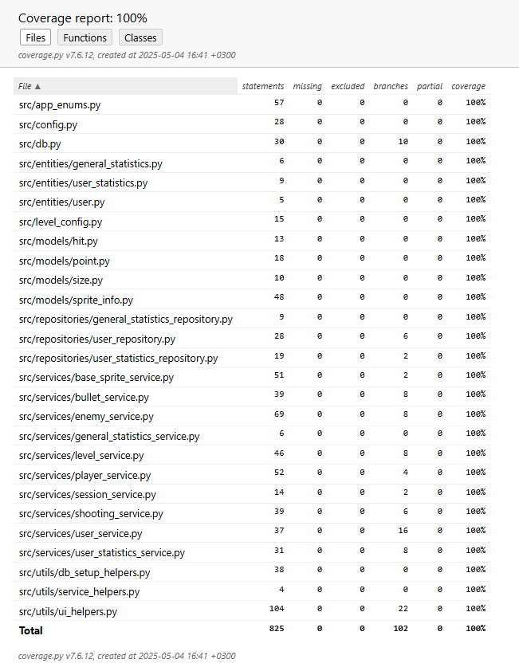

# Testausdokumentti 

Peliä on testattu manuaalisesti ja Pythonin unittest-kirjastolla. Tietokantatestejä varten on luotu muistiin tallentava 
testikanta. Testaissä on pyritty luomaan sekä yksittäisiä funktioita testaavia yksikkötestejä että useita luokkia kerralla testaavia testejä (esim. service-repository-db).
Jokaiselle testille on pyritty miettimään järkevä testi, joka varmistaa, että se toimii oikein. 
Peliä käynnistettäessä tarkistetaan onko tietokanta luotu ja muistutetaan käyttäjää ajamaan build, mikäli näin ei ole.
Lokaalin testaamisen (Linux) lisäksi on testattu jokaisen muutoksen kohdalla, että ohjelma käynnistyy myös Cubbli Linuxilla. Lisäksi on testattu kaikki release-paketit manuaalisesti, että ne käynnistyvät ja toimivat, kuten pitää.  
Kaikki määrittelydokumentin ja käyttöohjeen listaamat toiminnallisuudet on käyty läpi. 

## Manuaalinen testaaminen: 
Peliä koitettu pelata monin eri tavoin ja myös rikkoa erilaisilla syötteillä. 
Konfiguraatiota ja käyttäjämääriä säätämällä on voitu testata erilaisia skeanaarioita, kuten:
- Pelaaminen 1 käyttäjällä (Guest)
- Pelaaminen 2 käyttäjällä (Guest ja itse luotu)
- Pelaaminen 3 käyttäjällä (Guest ja 2 itseluotua)
- Pelaaminen 4 käyttäjällä (Guest ja 3 itseluotua) 
Peli Guestina ja kirjautuneena käyttäjänä:
- Pelin häviäminen 
- Pelin voittaminen (muutettu konfiguraatioilla tasojen määrää, ominaisuuksia ja helpotettu pelaamista vihollisten ominaisuuksia säätämällä)
- Tason vaihtuminen
- Vihollisen kuvan vaihtuminen, kun vaikeustaso nousee
- Vihollisen osumien määrän kasvaminen, kun vaikeustaso nousee
- Pelaajan pisteiden laskenta
- Pelaajan pisteiden vaihtuminen uudeksi omaksi ennätykseksi
- Pelaajan pisteiden vaihtuminen uudeksi yleisennätykseksi
- Pelaajan sydämien väheneminen ja osumat
- Vihollisten tuhoutuminen
- Vihollisten ampuminen
- Vihollisten liikkuminen (alaspäin, sivulle, lomittain, liikkeen nopeutuminen)
- Pelaajan luotien liikkuminen
- Pelaajan luotien tuhoutuminen
- Vihollisen luotien liikkuminen
- Vihollisen luotien tuhoutuminen
Aloitusvalikko Guestina ja kirjautuneena käyttäjänä:
- Pelin aloittaminen 
- Sisäänkirjautuminen
- Uuden käyttäjän luominen
- Paluu aloitusvalikkoon muista näkymistä 
- Pelin lopettaminen aloitusvalikosta 
- Uuden käyttäjän luominen lomakkeen syötteet
- Sisäänkirjautumisen syötteet virheellisillä arvoilla (tyhjä, liian pitkä, liian lyhyt)
- Sisäänkirjautumisen syötteet valideilla arvoilla

## Ohjelmallinen testaaminen 

Testauskattavuus on 100%. Pelissä on pyritty irrottamaan kaikki mahdollinen koodi käyttöliittymästä joko utils/helpers-luokkiin tai services-kerrokseen. Lisäksi jokainen luokka ja funktio yrittää olla mahdollisimman puhdas eli tehdä vain yhtä asiaa kerrallaan.  

### Yksikkötestaaminen 
Mahdollisimman suuri osa funktioista on yksikkötestattu eli kirjoitettu testi vain ja ainoastaan yhtä funktiota varten. Esimerkiksi jos funktio palauttaa totuusarvon, on pyritty testaamaan skenaario, missä funktio palauttaa arvon True ja toinen skenaario, missä funktio palauttaa arvon False. Jokainen sprite-service on testattu erilaisilla skenaarioilla. Esim. pelaajan liikkeet on testattu seuraavin skenaarioin:
- liikutaan oikealle
- liikutaan vasemmalle
- liikutaan oikealle, mutta mennään yli pelialueen 
- liikutaan vasemmalle, mutta mennään yli pelialueen 
- ei liikuta 

### Integraatiotestaaminen 

Testaamista varten on lisätty sqlite-testitietokanta, joka pyörii testin ajan muistissa. Kanta alustetaan jokaista testiä varten uudestaan, jolloin voidaan suorittaa seuraava testi ns. puhtaalta pöydältä. Jokaisen testiluokan alussa alustetaan uusi tietokanta. Alustamiseen on luotu apufunktioita, jolloin toisteisen koodin määrä jää testiluokissa pienemmäksi.  

### Testauskattavuus 

  

Testit on kirjoitettu seuraaville luokille:

#### Sprite-olioiden ja palvelukerroksen yhteentoimivuus:
- services/base_sprite_service
- services/bullet_service
- services/enemy_service
- services/player_service

#### Pelin generointi ja ohjaus 
- services/level_service
- services/session_service
- utils/game_helpers 

#### Pysyväistallennuksen ja palvelukerroksen yhteentoimivuustestit
- services/general_statistics_service
- services/user_service
- services/user_statistics_service 

### Pysyväistallennuksen yksikkötestit
- services/general_statistics_reository
- services/user_repository
- services/user_statistics_repository 

Yhteentoimivuustestit ja monet muutkin testit kattavat myös muita luokkia, koska skenaarioissa testataan monen luokan läpi kulkevia vaihtoehtoisia polkuja. Esimerkiksi user_statistics_service-luokassa testaaan käyttäjän tilastojen tallentamista ja varmistetaan, että tallennus onnistui. Tällöin kuljetaan service-luokasta ensin repositorioon ja samalla luodaan entity. Näin erilaisia tilanteita testaamalla saadaan katetuksi kaikkien luokkien kaikki vaihtoehtoiset polut. Lisäksi on testattu erikseen myös repositoriot yksikkötestein. 
