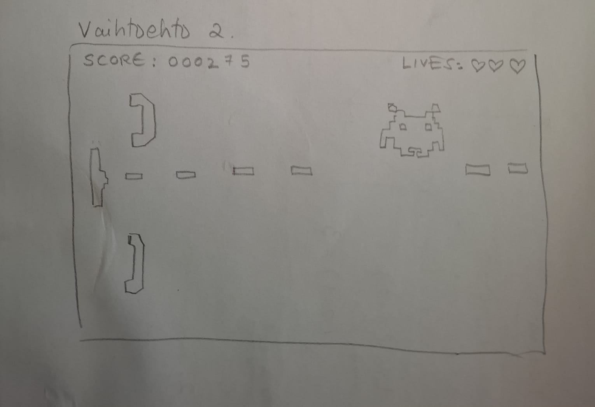

# Vaatimusmäärittely

## Sovelluksen tarkoitus

Space Invaders on sovellus, jossa pelaaja ohjaa avaruusalusta ja yrittää estää avaruusolentoja pääsemästä maahan. Peli sisältää erilaisia tasoja, joissa vihollisten määrä, voima ja nopeus kasvavat, ja pelaajan tavoitteena on selviytyä mahdollisimman pitkään hengissä. Pisteet tallennetaan SQLite-tietokantaan. 

## Käyttäjät

Pelin käyttäjärooli on _pelaaja_, joka ohjaa avaruusalusta ja yrittää tuhota vihollisia. Pelissä ei ole muita käyttäjärooleja, mutta peli voi tallentaa eri pelaajien tuloksia ja edistymistä.

## Teknologiat ja rajoitteet

- **Teknologiat:**
  - **Python**: Pelin logiikka ja pelimekaniikka toteutetaan Pythonilla.
  - **Pygame**: Pygame-kirjasto vastaa pelin visuaalisesta toteutuksesta ja animaatioista.
  - **SQLite**: Pelin tulokset tallennetaan SQLite-tietokantaan, jossa säilytetään pelaajan parhaat tulokset.
  - **unittest** ja **coverage**: Testaukseen käytetään unittest- ja coverage-työkaluja.
  - **Poetry**: Pakettien hallintaan ja projektin riippuvuuksien hallintaan käytetään Poetry-työkalua.

- **Rajoitteet:**
  - Ohjelman on toimittava HY TKTL laitoksen Cubbli Linuxilla.
  - Peli tallentaa pelaajan parhaat tulokset paikallisesti SQLite-tietokantaan.

## Käyttöliittymäluonnos

Pelinäkymä voi olla joko pysty- tai sivuttaissuuntainen:

tai 

Peli koostuu seuraavista osista:

1. **Aloitusnäkymä**
   - Näyttää pelin nimen ja "Aloita peli" -painikkeen.
   - Peli pyytää kirjautumaan sisään tai rekisteröimään käyttäjätunnuksen
   - Kun käyttäjä on kirjautunut tunnuksellaan sisään, peli alkaa
   - Pelissä ei ole monimutkaisempaa käyttöliittymää, vaan kaikki tapahtuu peliruudulla.

2. **Rekisteröitymisnäkymä**
   - Lomake, jolla voi luoda uuden käyttäjätunnuksen
   - Ohjaa takaisin kirjautumisnäkymään 

3. **Pelinäkymä**
   - Pelaaja ohjaa alusta näppäimistöllä.
   - Pelissä on vihollisia, jotka liikkuvat ja ampuvat kohti pelaajaa
   - Pelaaja voi ampua vihollisia ja estää niiden pääsyn maahan.
   - Näytetään pelaajan pisteet, jäljellä olevat elämät ja pelin taso.
   
4. **Pelin lopetusnäkymä**
   - Kun pelaaja häviää pelin, näytetään loppuruutu, jossa näkyy pelaajan pisteet ja vaihtoehto aloittaa peli alusta tai kirjautua ulos.

## Perusversion tarjoama toiminnallisuus

### Pelin toiminnot

- **Aloitusnäyttö**
  - Käyttäjä voi aloittaa pelin valitsemalla "Aloita peli" -painikkeen.
  
- **Pelin aikana**
  - Pelaaja voi liikkua avaruusaluksella kahteen vastakkaiseen suuntaan.
  - Pelaaja voi ampua raketteja kohti vihollisia.
  - Viholliset liikkuvat tasojen edetessä nopeammin.
  - Pelaajalla on rajoitettu määrä elämiä.
  - Pelaaja saa pisteitä jokaisesta tuhotusta vihollisesta.
  
- **Pelin loppu**
  - Kun kaikki viholliset on tuhottu tai pelaaja menettää kaikki elämänsä, peli loppuu.
  - Pelaajan tulos tallennetaan SQLite-tietokantaan, jos se on parempi kuin edellinen paras tulos.

### Pelin tallennus ja tietokanta

- Pelissä on SQLite-tietokanta, johon tallennetaan:
  - Pelaajan nimi (tai nimimerkki) ja salasana.
  - Pelaajan paras pistemäärä.
  - Pelin aikaleima.

### Pelin testaus

- **Testaus**:
  - Pelin logiikkaa testataan **unittest**-kirjastolla.
  - Käytetään **coverage**-työkalua, jotta voidaan varmistaa koodin kattavuus.
  
- **Testattavat osa-alueet**:
  - Peli tulisi käynnistyä ilman virheitä.
  - Pelaajan liikkuminen ja ampuminen pitäisi toimia oikein.
  - Vihollisten liikkuminen ja niiden tuhoaminen pitää toimia.
  - Pelin loppumekanismi ja tulosten tallentaminen tietokantaan tulee olla toimivia.

## Jatkokehitysideoita (tai jos aikaa jää)

Perusversion jälkeen järjestelmää täydennetään mahdollisesti seuraavilla toiminnoilla:

- **Hahmonkehitys**: Mahdollisuus kehittää pelihahmon ominaisuuksia saavuttamalla tiettyjä tasoja pelissä tai keräämällä bonuksia.
- **Pelaajan aseiden kehittäminen**: Mahdollisuus kehittää pelihahmon aseita keräämällä esim. tietyn määrän pisteitä tai tuhoamalla tiettyjä erikoisvihollisia, jotka tiputtavat parempia aseita. 
- **Moninpeli**: Mahdollisuus pelata kahdella pelaajalla samassa pelissä.
- **Erilaiset vihollistyypit**: Vihollisille lisätään eri käyttäytymismalleja ja voimakkuuksia.
- **Tehtävät ja palkinnot**: Pelaajalle voidaan asettaa tavoitteita ja palkintoja pelin aikana.
- **Pelin vaikeustason säätäminen**: Pelaaja voi valita pelin vaikeustason ennen peliä.
- **Äänet ja musiikki**: Pelissä voidaan lisätä taustamusiikkia ja äänitehosteita.
- **Grafiikan parantaminen**: Pelin visuaalisuutta voidaan parantaa esimerkiksi erilaisten taustojen ja animaatioiden avulla.

## Yhteenveto

Tässä vaatimusmäärittelyssä on hahmoteltu perustoiminnot Space Invaders -pelille, jossa käytetään Pythonia, Pygamea, SQLitea, unittestia, coverage-työkalua ja Poetrya projektin hallintaan. Pelissä pelaaja ohjaa alusta, taistelee vihollisia vastaan ja yrittää saavuttaa parhaan mahdollisen pistemäärän.
