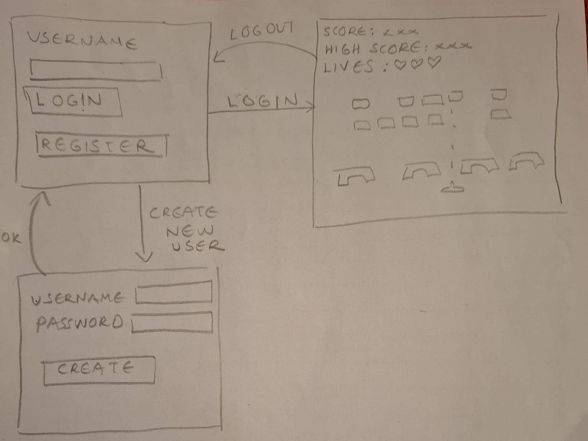
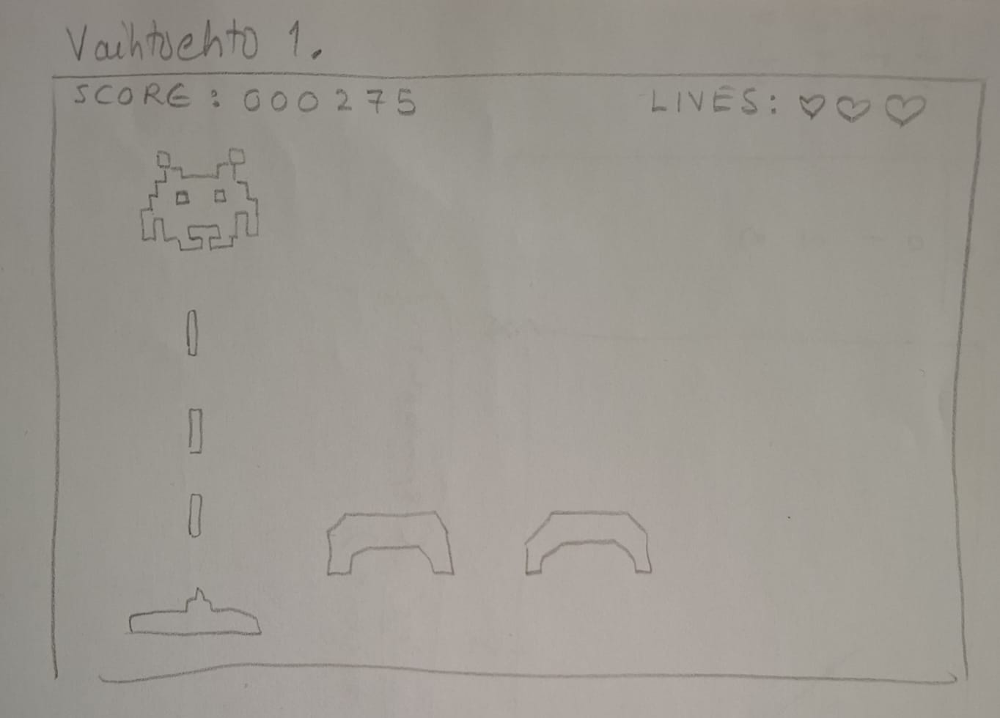

# Vaatimusmäärittely

## Sovelluksen tarkoitus

Space Invadersin kaltainen avaruustaistelu on sovellus, jossa pelaaja ohjaa avaruusalusta ja yrittää estää avaruusolentoja pääsemästä maahan. Peli sisältää erilaisia tasoja, joissa vihollisten määrä, voima ja nopeus kasvavat, ja pelaajan tavoitteena on selviytyä mahdollisimman pitkään hengissä. Pisteet tallennetaan SQLite-tietokantaan. 

## Käyttäjät

Pelin käyttäjärooli on _pelaaja_, joka ohjaa avaruusalusta ja yrittää tuhota vihollisia. Pelissä ei ole muita käyttäjärooleja, mutta peli voi tallentaa eri pelaajien tuloksia ja edistymistä.

## Teknologiat ja rajoitteet

- **Teknologiat:**
  - **Python**: Pelin logiikka ja pelimekaniikka toteutetaan Pythonilla.
  - **Pygame**: Pygame-kirjasto vastaa pelin visuaalisesta toteutuksesta ja animaatioista.
  - **SQLite**: Pelin tulokset tallennetaan SQLite-tietokantaan, jossa säilytetään pelaajan parhaat tulokset.
  - **unittest** ja **coverage**: Testaukseen käytetään unittest- ja coverage-työkaluja.
  - **Poetry**: Pakettien hallintaan ja projektin riippuvuuksien hallintaan käytetään Poetry-työkalua.

- **Rajoitteet:**
  - Ohjelman on toimittava HY TKTL laitoksen Cubbli Linuxilla.
  - Peli tallentaa pelaajan parhaat tulokset paikallisesti SQLite-tietokantaan.

## Käyttöliittymäluonnos

Pelinäkymä voi olla joko pysty- tai sivuttaissuuntainen:

Peli koostuu seuraavista osista:

[X] = toteutettu

1. **Aloitusnäkymä**
     
[X]   - Näyttää pelin nimen ja "Aloita peli" -painikkeen.    
[X]   - Pelin voi käynnistää anonyymina pelaajana.       
[X]   - Peli pyytää kirjautumaan sisään tai rekisteröimään käyttäjätunnuksen.         
[X]   - Kun käyttäjä on kirjautunut tunnuksellaan sisään, käyttäjä näkee oman parhaan tuloksensa ja Aloita peli-vaihtoehdon.  
[ ]   - Kun käyttäjä on kirjautunut tunnuksellaan sisään, käyttäjä näkee uloskirjautumisvaihtoehdon.          
[X]   - Pelissä ei ole monimutkaisempaa käyttöliittymää, vaan kaikki tapahtuu peliruudulla.
[ ]   - Tulostaa 3 kaikkien aikojen parasta pelitulosta eli high scorea     

2. **Rekisteröitymisnäkymä**

[X]   - Lomake, jolla voi luoda uuden käyttäjätunnuksen     
[X]   - Ohjaa takaisin kirjautumisnäkymään 

3. **Pelinäkymä**

[X]   - Pelaaja ohjaa alusta näppäimistöllä.         
[X]   - Pelissä on vihollisia, jotka liikkuvat kohti pelaajaa           
[X]   - Pelaaja voi ampua vihollisia           
[X]   - Viholliset ampuvat kohti pelaajaa            
[X]   - Pelaajan ammus tuhoaa vihollisen             
[X]   - Vihollisen ammus tuhoaa pelaajan  
[X]   - Näytetään jäljellä olevat elämät                  
[X]   - Näytetään pelaajan pisteet         
[X]   - Näytetään pelin taso     
[X]   - Näytetään sisäänkirjautuneelle pelaajalle paras tulos                
 
4. **Pelin lopetusnäkymä**

[X]   - Kun pelaaja häviää pelin, näytetään loppuruutu, jossa näkyy pelaajan pisteet.        
[X]   - Kun pelaaja häviää pelin, loppuruutu ohjaa takaisin aloitusnäkymään.           
[ ]   - Kun pelaaja häviää pelin, näytetään loppuruutu, jossa näkyy pelaajan tulos ja pelin high score eli kaikkien aikojen paras tulos.              
[X]   - Kun sisäänkirjautunut pelaaja häviää pelin, näytetään loppuruutu, jossa näkyy myös pelaajan oma high score eli paras henkilökohtainen tulos.             

## Perusversion tarjoama toiminnallisuus

### Pelin toiminnot

- **Aloitusnäyttö**

[X]  - Käyttäjä voi aloittaa pelin valitsemalla "Aloita peli" -painikkeen.    
[X]  - Käyttäjä voi kirjautua sisään.     
[X]  - Käyttäjä voi luoda uuden tunnuksen.    
[X]  - Käyttäjä voi lopettaa pelin.    
[X]  - Sisäänkirjautunut käyttäjä voi kirjautua ulos.    
  
- **Pelin aikana**

[X] - Pelaaja voi liikkua avaruusaluksella kahteen vastakkaiseen suuntaan.      
[X] - Pelaaja voi ampua raketteja kohti vihollisia.      
[X] - Viholliset liikkuvat nopeammin mitä lähempänä ne ovat pelaajaa.      
[X] - Pelaajalla on rajoitettu määrä elämiä.     
[X] - Tason vihollisten tuhoutuessa aloitetaan uusi taso.      
[X] - Pelaaja saa pisteitä jokaisesta tuhotusta vihollisesta.      
  
- **Pelin loppu**

[X] - Kun kaikki viholliset viimeisestä pelitasosta on tuhottu tai pelaaja menettää kaikki elämänsä, peli loppuu.          
[X] - Kun kaikki viholliset viimeisestä pelitasosta on tuhottu, pelaaja voittaa.           
[X] - Kun pelaaja menettää kaikki elämänsä pelaaja häviää.         
[X] - Pelaajan tulos tallennetaan SQLite-tietokantaan, jos se on parempi kuin edellinen paras tulos.         

### Pelin tallennus ja tietokanta

- Pelissä on SQLite-tietokanta, johon tallennetaan:   
        
[X] - Pelaajan nimi (tai nimimerkki) ja salasana.        
[X] - Pelaajan paras pistemäärä.     
[X] - Pelin aikaleima.         

### Pelin testaus

- **Testaus**:

[X]  - Pelin logiikkaa testataan **unittest**-kirjastolla.         
[X]  - Käytetään **coverage**-työkalua, jotta voidaan varmistaa koodin kattavuus.
  
- **Testattavat osa-alueet**:

[X]  - Pelin alustaminen          
[X]  - Pelaajan liikkuminen        
[X]  - Pelaajan ampuminen          
[X]  - Vihollisten liikkuminen           
[X]  - Vihollisten ampuminen            
[X]  - Tulosten tallentaminen tietokantaan         

## Jatkokehitysideoita (tai jos aikaa jää)

Perusversion jälkeen järjestelmää täydennetään mahdollisesti seuraavilla toiminnoilla:

- **Hahmonkehitys**: Mahdollisuus kehittää pelihahmon ominaisuuksia saavuttamalla tiettyjä tasoja pelissä tai keräämällä bonuksia.
- **Pelaajan aseiden kehittäminen**: Mahdollisuus kehittää pelihahmon aseita keräämällä esim. tietyn määrän pisteitä tai tuhoamalla tiettyjä erikoisvihollisia, jotka tiputtavat parempia aseita. 
- **Moninpeli**: Mahdollisuus pelata kahdella pelaajalla samassa pelissä.
- **Erilaiset vihollistyypit**: Vihollisille lisätään eri käyttäytymismalleja ja voimakkuuksia.
- **Tehtävät ja palkinnot**: Pelaajalle voidaan asettaa tavoitteita ja palkintoja pelin aikana.
- **Pelin vaikeustason säätäminen**: Pelaaja voi valita pelin vaikeustason ennen peliä.
- **Äänet ja musiikki**: Pelissä voidaan lisätä taustamusiikkia ja äänitehosteita.
- **Grafiikan parantaminen**: Pelin visuaalisuutta voidaan parantaa esimerkiksi erilaisten taustojen ja animaatioiden avulla.
