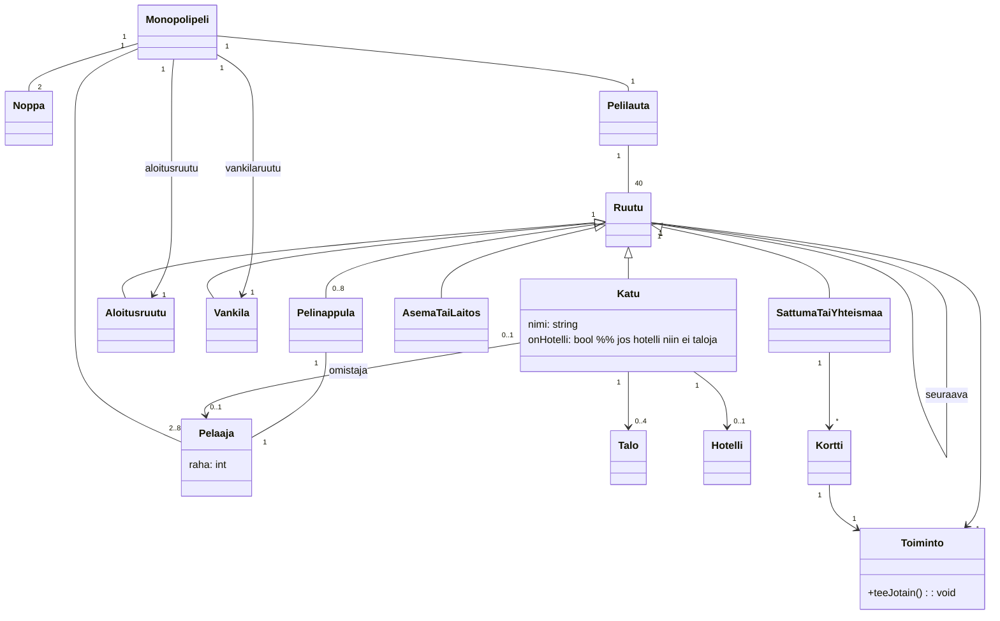

## Monopoli, alustava luokkakaavio

```mermaid
classDiagram
    Monopolipeli "1" -- "2" Noppa
    Monopolipeli "1" -- "1" Pelilauta
    Pelilauta "1" -- "40" Ruutu
    Ruutu "1" -- "1" Ruutu : seuraava
    Ruutu "1" -- "0..8" Pelinappula
    Pelinappula "1" -- "1" Pelaaja
    Pelaaja "2..8" -- "1" Monopolipeli

    Monopolipeli "1" --> "1" Aloitusruutu : aloitusruutu
    Monopolipeli "1" --> "1" Vankila : vankilaruutu

    Ruutu <|-- Aloitusruutu
    Ruutu <|-- Vankila
    Ruutu <|-- SattumaTaiYhteismaa
    Ruutu <|-- AsemaTaiLaitos
    Ruutu <|-- Katu

   
    class Katu {
        nimi: string
        onHotelli: bool %% jos hotelli niin ei taloja
    }

    class Talo
    class Hotelli

    Katu "1" --> "0..4" Talo
    Katu "1" --> "0..1" Hotelli

    %% Huom! Katu voi sisältää joko 0–4 taloa TAI yhden hotellin, mutta ei molempia samanaikaisesti.

    Katu "0..1" --> "0..1" Pelaaja : omistaja

    class Pelaaja {
        raha: int
    }

    class Toiminto {
        +teeJotain(): void
    }

    class Kortti
    SattumaTaiYhteismaa "1" --> "*" Kortti

    Ruutu "1" --> "1" Toiminto
    Kortti "1" --> "1" Toiminto
```
