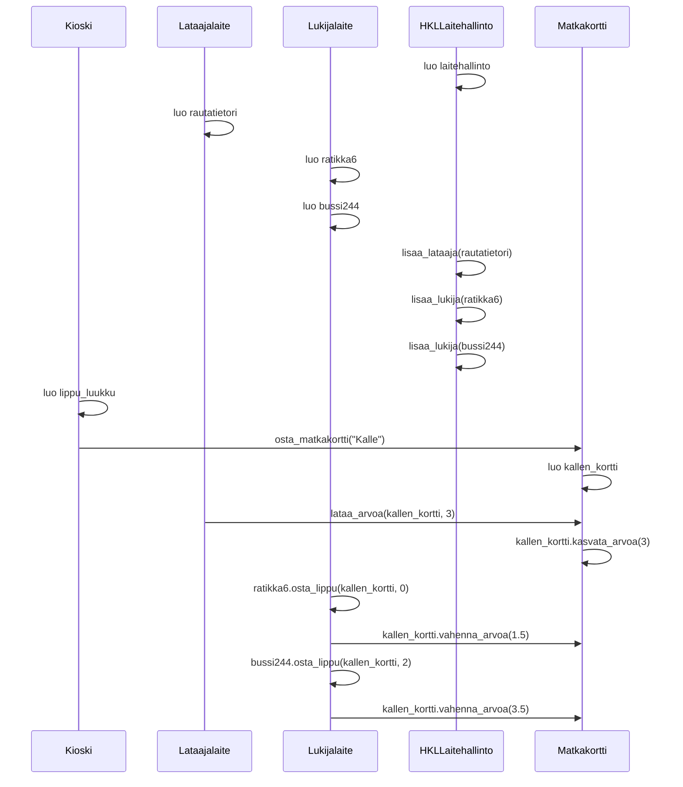

```mermaid
sequenceDiagram
    participant Kioski
    participant Lataajalaite
    participant Lukijalaite
    participant HKLLaitehallinto
    participant Matkakortti

    HKLLaitehallinto->>HKLLaitehallinto: luo laitehallinto
    Lataajalaite->>Lataajalaite: luo rautatietori
    Lukijalaite->>Lukijalaite: luo ratikka6
    Lukijalaite->>Lukijalaite: luo bussi244
    HKLLaitehallinto->>HKLLaitehallinto: lisaa_lataaja(rautatietori)
    HKLLaitehallinto->>HKLLaitehallinto: lisaa_lukija(ratikka6)
    HKLLaitehallinto->>HKLLaitehallinto: lisaa_lukija(bussi244)

    Kioski->>Kioski:luo lippu_luukku

    Kioski->>Matkakortti: osta_matkakortti("Kalle")
    Matkakortti->>Matkakortti: luo kallen_kortti

    Lataajalaite->>Matkakortti: lataa_arvoa(kallen_kortti, 3)

    Matkakortti->>Matkakortti: kallen_kortti.kasvata_arvoa(3)

    Lukijalaite->>Lukijalaite: ratikka6.osta_lippu(kallen_kortti, 0)
    Lukijalaite->>Matkakortti: kallen_kortti.vahenna_arvoa(1.5)

    Lukijalaite->>Lukijalaite: bussi244.osta_lippu(kallen_kortti, 2)
    Lukijalaite->>Matkakortti: kallen_kortti.vahenna_arvoa(3.5)
```